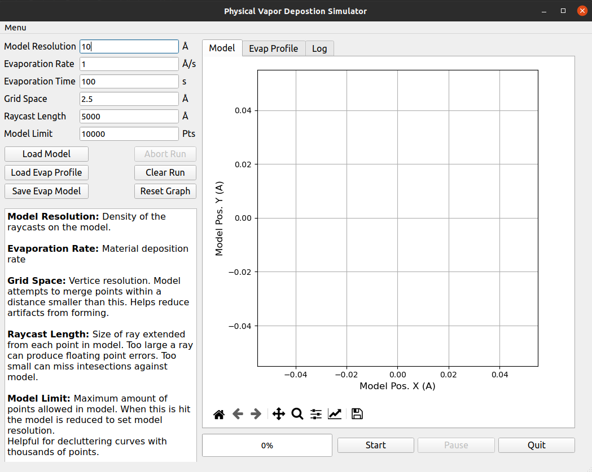
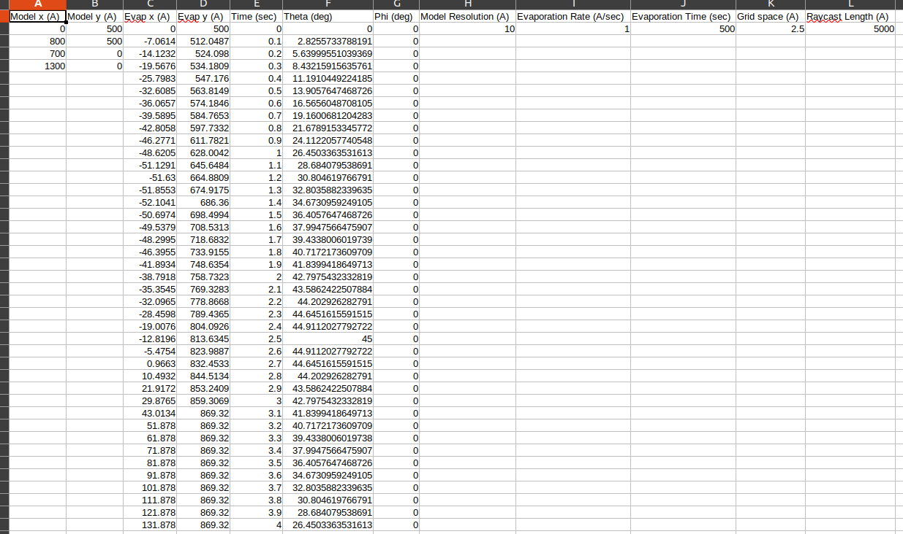

# Evaporation Simulator
Cross sectional evaporation simulator for evaporant clouds from either thermal or e-beam evaporation and sputtering.

The evaporation simulation assumes some basic information about the vacuum system setup that allows for a straight forward approach to estimating the amount of evaporation added to the model at any particular angle.

Current install instructions:
```
$ conda activate

$ pip install git+https://github.com/ColdAdam/Evaporation_Simulator.git@main

$ python
>>> import evapsim
```
This will run the program:



The model files is saved as a single .csv file containing the vertices of the cross section and the evaporation sweep used with it. Any sweep or model can be
loaded from other .csv files as long as the header column names remain the same:
For the model file:

```
Model x (A), Model y (A)
```


and for raycast profile

```
Time (sec), Theta (deg), Phi (deg)
```

The model asserts these exist on loading.
